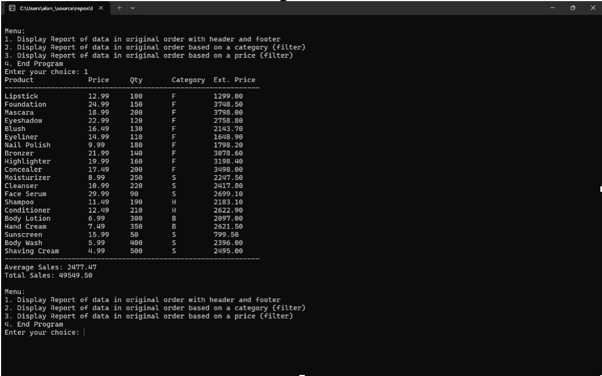
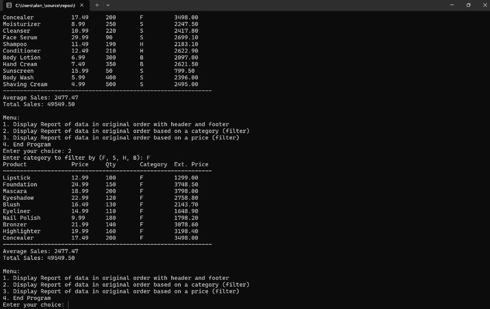
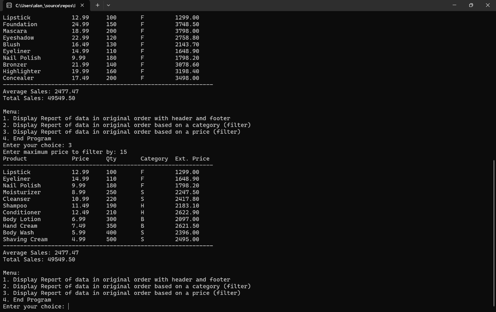

# Cosmetics Inventory & Sales Reporting System (C++)

## Description
A C++ console application that manages a cosmetics inventory and generates structured sales reports. 
The program provides menu-driven options to display the full report, filter products by category, filter by maximum price, and compute summary statistics.

## Features
- Menu-driven report system
- Category-based product filtering
- Price-based filtering
- Calculates totals and averages for sales
- Formatted report output using iomanip
- Modular design using functions

## Technologies
- C++
- Visual Studio (original environment)

## How to Run
1. Open the project in Visual Studio (or another C++ IDE)
2. Build and run the program

## What I Learned
- Writing modular C++ programs with multiple functions
- Working with arrays and structured data
- Generating formatted business-style reports
- Implementing filtering logic and calculations

## Screenshots

### Main Menu

### Sample Report

### Filtered Results

